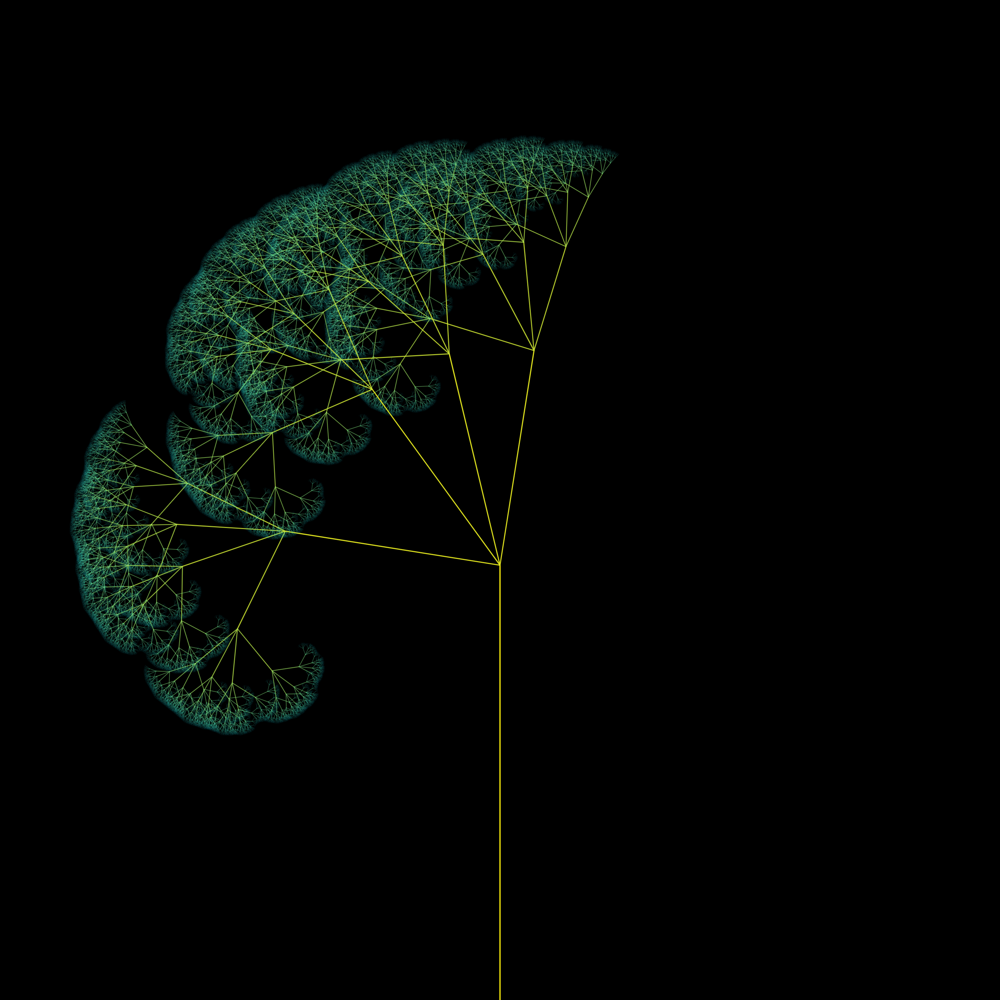

# Beautiful Tree

This project generates a beautiful tree visualization using p5.js.

## About

This project is a simple exploration of recursive patterns to generate a tree like structure. It is built using the p5.js library.

## Demo

## Usage

To run this project:

1.  Ensure you have a web browser.
2.  Clone the repository from [https://github.com/ivanrj7j/BeautifulTree](https://github.com/ivanrj7j/BeautifulTree).
3.  Open the `index.html` file in your web browser.

## Credits

This project was created by ivanrj7j.

## License

This project is open-source.